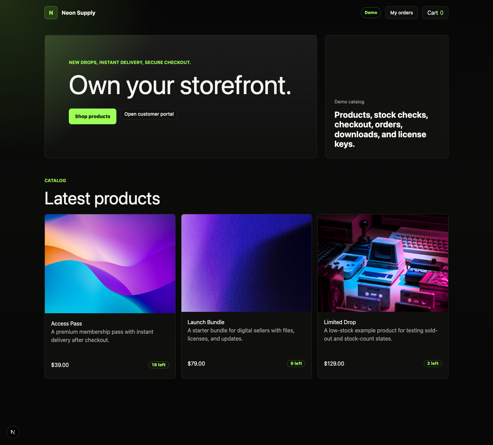

# Shoppex Storefront Starter

Custom storefront foundation powered by Shoppex commerce.

[](https://vercel.com/new/clone?repository-url=https://github.com/shoppexio/storefront-starter&env=NEXT_PUBLIC_SHOPPEX_SHOP_SLUG,NEXT_PUBLIC_CUSTOMER_PORTAL_URL,SHOPPEX_WEBHOOK_SECRET,SHOPPEX_DISCORD_WEBHOOK_URL)



## What This Starter Includes

- Next.js App Router storefront
- Shoppex Storefront SDK wiring
- shadcn/ui primitives for buttons, forms, sheets, badges, and toasts
- product listing and product detail pages
- stock and sold-out states
- local cart drawer
- cart review for changed products, options, stock, quantity limits, and prices
- checkout page that creates a Shoppex invoice from cart
- customer portal link configuration
- signed webhook route example for fulfillment notifications
- Vercel deployment config

The storefront layout, hero, product cards, and brand styling stay custom. shadcn is used as the accessible primitive layer for controls.

## Run Locally

Create a new storefront from the public starter:

```bash
bunx create-shoppex-storefront my-store
```

From the exported public starter repo:

```bash
bun install
bun run dev
```

From the Shoppex monorepo:

```bash
bun run dev --filter=@shoppex/storefront-starter
```

## Configure

Copy `.env.example` into `.env.local` and update the shop values:

```txt
NEXT_PUBLIC_SHOPPEX_SHOP_SLUG=your-shop
NEXT_PUBLIC_SHOPPEX_USE_SAMPLE_DATA=false
NEXT_PUBLIC_CUSTOMER_PORTAL_URL=https://your-shop.myshoppex.io/dashboard
SHOPPEX_WEBHOOK_SECRET=your-webhook-secret
SHOPPEX_DISCORD_WEBHOOK_URL=https://discord.com/api/webhooks/...
```

By default, `NEXT_PUBLIC_SHOPPEX_SHOP_SLUG=demo` enables sample products so the starter has a real-looking preview before a merchant connects Shoppex.

Then edit:

```txt
shoppex.config.ts
theme.config.ts
```

Simple example:

```ts
export const shoppexConfig = {
  shopSlug: "your-shop",
  checkoutMode: "cart",
  showStockCount: true,
  customerPortal: {
    mode: "branded-subdomain",
    url: "https://account.yourdomain.com",
  },
};
```

Use `theme.config.ts` for brand name, hero copy, and color tokens.

For a full setup walkthrough, see `docs/merchant-setup.md`.

For merchants moving from Komerza, SellAuth, Sellpass, or a custom frontend, see `docs/fresh-start-migration.md`.

## Demo Catalog

The starter includes a demo catalog for local previews and screenshots.

```txt
NEXT_PUBLIC_SHOPPEX_SHOP_SLUG=demo
```

or:

```txt
NEXT_PUBLIC_SHOPPEX_USE_SAMPLE_DATA=true
```

Sample products can be added to cart and reviewed on the checkout page, but payments stay disabled until a real Shoppex shop slug is configured.

## Checkout Modes

`checkoutMode: "cart"` is the default. Buyers add multiple items, review the cart, enter email, and continue to Shoppex payment.

`checkoutMode: "buy-now"` is useful for one-product stores. The product detail button clears the current cart, adds the selected product, and sends the buyer to `/checkout`.

`checkoutMode: "embed"` is documented for simple product-button flows, but this starter's main path is cart-to-invoice checkout.

## Customer Portal

The starter links buyers to the Shoppex customer portal for orders, downloads, and license keys.

For Shoppex-routed custom domains, the customer portal URL can be:

```txt
/dashboard
```

For fully self-hosted storefronts, prefer a branded customer portal domain:

```txt
https://account.yourdomain.com
```

Simple examples:

```txt
your-shop.myshoppex.io/dashboard        -> fastest setup
yourdomain.com/dashboard               -> works when the domain is routed through Shoppex
account.yourdomain.com                 -> recommended branded setup for self-hosted Vercel storefronts
```

## Cart Model

The cart lives in the buyer's browser until checkout. When the buyer starts checkout, Shoppex rechecks products, variants, pricing, coupons, and stock before creating the invoice.

Simple flow:

```txt
Local cart -> Shoppex invoice -> hosted payment -> fulfillment
```

The starter does not reserve stock when an item is added to cart.

## Cart Review

The checkout page refreshes product data before payment. If a product was removed, sold out, had an option removed, changed quantity limits, or changed price, the buyer sees a review panel instead of a generic checkout error.

Simple example:

```txt
Buyer has 5 items in cart
Shop stock changes to 2
Checkout shows "Only 2 can be purchased right now"
Buyer clicks "Apply recommended updates"
Cart updates to quantity 2
```

## Webhook Example

`src/app/api/shoppex/webhook/route.ts` accepts Shoppex webhook deliveries and forwards paid order notifications to Discord.

Set `SHOPPEX_WEBHOOK_SECRET` to verify `X-Shoppex-Signature`. Set `SHOPPEX_DISCORD_WEBHOOK_URL` to forward notifications.

For production fulfillment, keep webhook handlers idempotent by storing the `X-Shoppex-Delivery` value before sending license keys or Discord role grants.

## Deploy to Vercel

When this starter is exported to `shoppexio/storefront-starter`, use:

```txt
https://vercel.com/new/clone?repository-url=https://github.com/shoppexio/storefront-starter&env=NEXT_PUBLIC_SHOPPEX_SHOP_SLUG,NEXT_PUBLIC_CUSTOMER_PORTAL_URL,SHOPPEX_WEBHOOK_SECRET,SHOPPEX_DISCORD_WEBHOOK_URL
```

For the in-monorepo app, deploy the `apps/storefront-starter` directory and set the same environment variables in Vercel.

## Export Public Repo

From the monorepo root:

```bash
bun run release:export:storefront-starter --out-dir /tmp/shoppex-storefront-starter
```

The export script copies this starter, removes local build artifacts, and changes `@shoppexio/storefront` from `workspace:*` to the currently tracked public SDK version.
